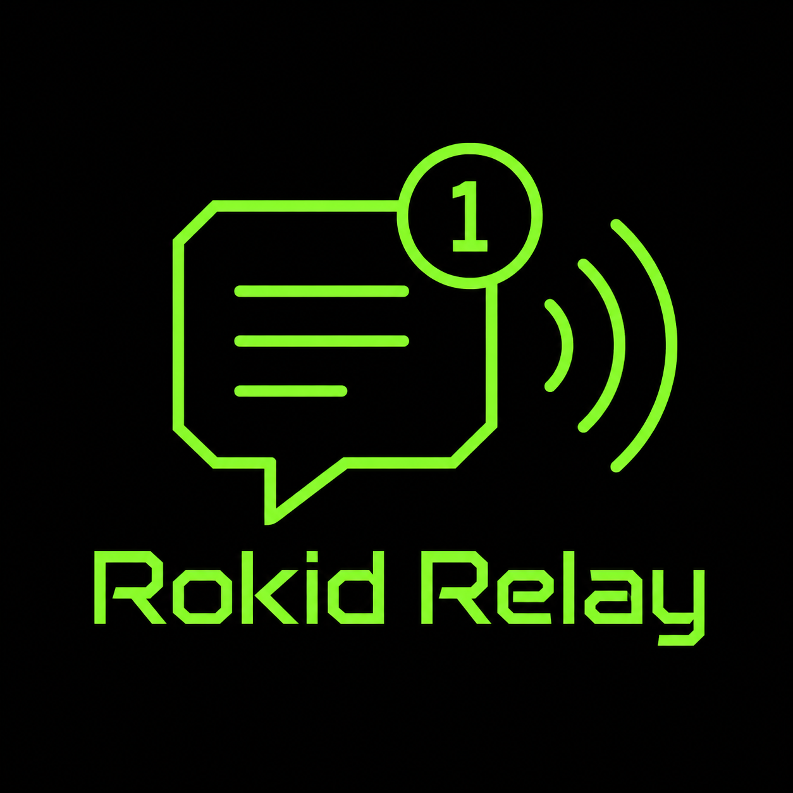
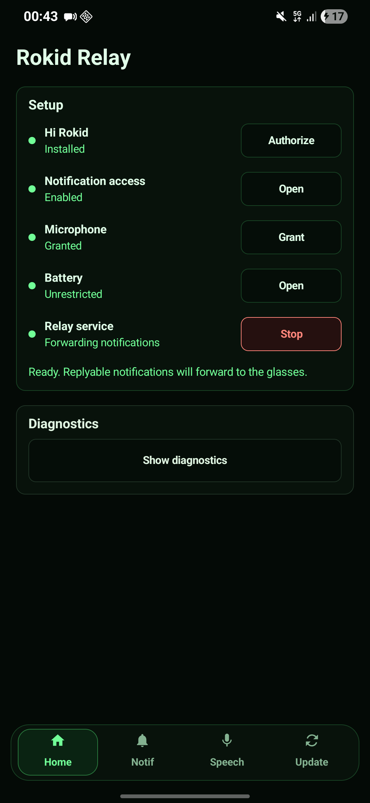
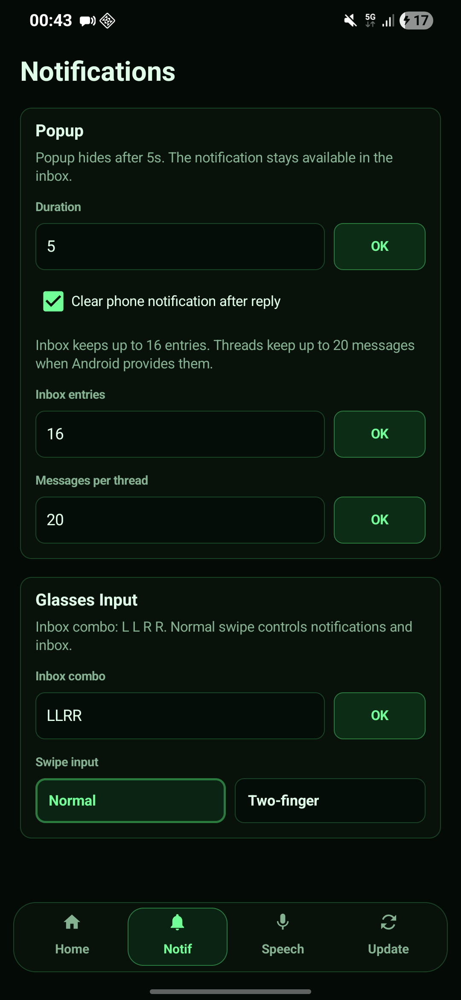
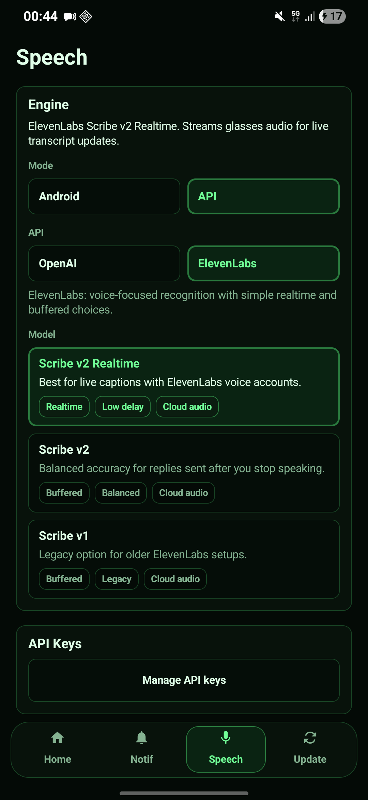
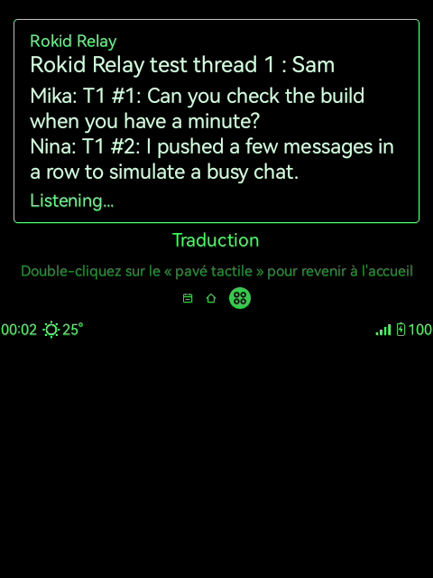

<p align="center">
  
</p>

<h1 align="center">Rokid Relay</h1>

<p align="center">
  <a href="#requirements"></a>
  <a href="#project-structure"></a>
  <a href="#how-it-works"></a>
  <a href="#speech-setup"></a>
  <a href="#status"></a>
</p>

<p align="center">
  Reply to Android phone notifications from Rokid glasses with a tiny glasses overlay,
  the glasses microphone, CXR-L through Hi Rokid, and Android direct reply.
</p>

<p align="center">
  <a href="https://ko-fi.com/M8R61ZTXMI" target="_blank">
    
  </a>
</p>

---

## Status

Rokid Relay is a development-preview split Android app. It is meant for local testing on a phone paired to Rokid glasses, not yet as a polished store release.

---

## Screenshots

<p align="center">
  
  
  
</p>

<p align="center">
  <em>Phone setup, notification routing, and speech-to-text settings</em>
</p>

<p align="center">
  <a href="docs/media/rokid-relay-hud-live.mp4">
    
  </a>
</p>

<p align="center">
  <em>Click the preview to open the silent glasses HUD demo video.</em>
</p>

---

## What it does

Rokid Relay forwards replyable Android notifications from the phone to the glasses, then lets you answer without pulling out the phone.

- The phone app listens for notifications that expose an Android `RemoteInput` reply action.
- The phone app connects to Global Hi Rokid through CXR-L and starts or installs the glasses helper when possible.
- The glasses app receives notification events through CXR-S and renders a compact green overlay above other glasses apps.
- Direction input on the glasses starts a voice reply.
- Speech-to-text runs from the glasses microphone stream, then the phone sends the final text through the original notification reply action.
- A small inbox lets you revisit recent replyable notifications and switch between them from the glasses.

No cloud relay server is used by Rokid Relay itself. Cloud speech-to-text is used only when you explicitly choose an OpenAI or ElevenLabs engine.

---

## Project structure

```text
phone/      Android phone relay app, CXR-L bridge, notification listener, STT, API keys
glasses/    Rokid glasses helper app, CXR-S bridge, setup screen, accessibility overlay
```

The phone debug build bundles the current glasses debug APK as:

```text
phone/src/main/assets/rokid-relay-glasses.apk
```

That asset is generated by the Gradle `copyGlassesClient` task when building `:phone:assembleDebug`.

---

## Requirements

- Android phone on Android 12+ (`minSdk 31`).
- Rokid glasses connected to the phone through Global Hi Rokid.
- Global Hi Rokid package visible on the phone: `com.rokid.sprite.global.aiapp`.
- Android SDK, platform tools, and a working Gradle/JDK setup.
- The sibling `../CxrGlobal` project, used as the local CXR-L wrapper.
- Optional OpenAI or ElevenLabs API key if you want cloud speech-to-text.

Rokid Relay does not need OpenAI or ElevenLabs keys at build time. Those keys are configured inside the phone app.

---

## Build

From the project root:

```powershell
.\gradlew.bat :phone:assembleDebug :glasses:assembleDebug
```

Debug outputs:

```text
phone/build/outputs/apk/debug/phone-debug.apk
glasses/build/outputs/apk/debug/glasses-debug.apk
```

Building the phone APK also builds and copies the glasses APK into the phone app assets so the phone can install/start the helper through Hi Rokid when the CXR-L path is ready.

---

## Install during development

Install the phone app on the Android phone:

```powershell
adb install -r phone/build/outputs/apk/debug/phone-debug.apk
```

Usually the phone app can deploy/start the glasses helper after Hi Rokid authorization. For direct glasses debugging, install the glasses APK manually:

```powershell
adb install -r glasses/build/outputs/apk/debug/glasses-debug.apk
```

Do not publish local APKs built with private credentials, local tokens, or debug-only changes.

---

## First run

1. Install and open `Rokid Relay` on the phone.
2. Grant Bluetooth permissions. Grant notification permission on Android 13+ if requested.
3. Make sure Global Hi Rokid is installed and the glasses are connected to it.
4. In the phone app, tap `Authorize` on the `Hi Rokid` row and approve the Hi Rokid authorization screen.
5. Tap `Open` on the `Notification access` row and enable Rokid Relay in Android notification listener settings.
6. Choose a speech engine in the `Speech` panel.
7. If you choose `API`, pick `OpenAI` or `ElevenLabs`, pick a model, then use `Manage API keys`.
8. Open the glasses helper once. If no notification is showing, tap on the glasses screen to open Accessibility settings.
9. Enable `Rokid Relay overlay` in Accessibility on the glasses.
10. Return to the glasses app. The setup screen should show `ACCESSIBILITY ON`.

After the phone has a saved Hi Rokid token, notification access, and a ready STT engine, the relay starts automatically when the app opens and on supported Android events such as boot, app update, Bluetooth reconnect, and notification-listener connection.

The phone keeps a foreground `Rokid Relay running` notification while relay mode is active. Use the phone app `Stop` button or the foreground notification action to stop it.

### Hi Rokid notification routing

Rokid Relay does not currently suppress or coordinate with Hi Rokid's own notification mirroring. If Hi Rokid is also forwarding the same phone notifications to the glasses, you may see duplicate notification UI: one from Hi Rokid and one from Rokid Relay.

Recommended setup:

1. In Global Hi Rokid, disable phone notification mirroring entirely if you want Rokid Relay to own the notification experience.
2. Or, disable Hi Rokid notifications only for apps where replies matter, such as messaging apps.
3. Keep non-replyable apps enabled in Hi Rokid if you still want normal glance-only notifications there.

In practice, the cleanest split is: replyable messaging apps go through Rokid Relay, and everything else can stay on Hi Rokid.

---

## Speech setup

Rokid Relay has two speech modes.

### Android

`Android CXR` uses Android speech recognition with the glasses CXR audio stream. It does not require an API key, but it does require microphone permission and a microphone foreground-service type while capture is active.

### API

API engines use the same glasses microphone audio, but send it to the selected provider.

Use an API engine when you want better recognition quality than the Android speech recognizer, or when the phone's local recognizer is unreliable with the glasses PCM route. This requires internet access and sends the captured reply audio to the selected provider.

OpenAI engines:

- `OpenAI GPT Realtime Whisper`: realtime transcript updates while speaking.
- `OpenAI GPT-4o Transcribe`: buffered audio, best for longer/accurate replies.
- `OpenAI GPT-4o mini Transcribe`: buffered audio, lower-cost everyday option.

ElevenLabs engines:

- `ElevenLabs Scribe v2 Realtime`: realtime transcript updates.
- `ElevenLabs Scribe v2`: buffered audio, balanced option.
- `ElevenLabs Scribe v1`: legacy buffered option.

As of 2026-05-27, ElevenLabs lists a Free plan with 10k credits per month. On the current ElevenLabs API pricing table, that is roughly enough for about 4 hours 30 minutes of buffered Scribe v1/v2 speech-to-text, or about 2 hours 30 minutes of Scribe v2 Realtime. Check the [live ElevenLabs pricing page](https://elevenlabs.io/pricing) before relying on those numbers for heavy usage.

### API keys

To add or change keys:

1. Create an API key in the provider dashboard:
   - OpenAI: use the [OpenAI API keys page](https://platform.openai.com/settings/organization/api-keys) in the OpenAI platform.
   - ElevenLabs: create an API key from the ElevenLabs dashboard or Developers/API Keys area. ElevenLabs' [API authentication docs](https://elevenlabs.io/docs/api-reference/quick-start/authentication) also describe `xi-api-key` authentication.
2. Open the Rokid Relay phone app.
3. In `Speech`, select `API`.
4. Select `OpenAI` or `ElevenLabs`.
5. Select the model you want to use.
6. Tap `Manage API keys`.
7. Paste the key into the provider field.
8. Tap `Save`.

Keys are stored on the phone in app preferences encrypted with Android Keystore AES-GCM. The README, Gradle files, and `local.properties` should never contain OpenAI or ElevenLabs keys. Use `Clear` in the phone app to remove a saved key. Provider dashboards remain the source of truth for usage, quotas, billing, and key rotation.

---

## Glasses controls

When a replyable notification popup is visible:

| Control | Action |
| --- | --- |
| Swipe/DPAD left or right | Start voice reply |
| Tap/OK/center | Dismiss the current popup |
| Back | Dismiss the current popup |

During voice capture:

| State | Control | Action |
| --- | --- | --- |
| Listening/recognizing/processing | OK or Back | Cancel voice capture |
| Review countdown | OK | Re-record before the reply is sent |
| Review countdown | Wait | Send the reply automatically |

After a successful reply, the overlay briefly shows `SENT`.

---

## Inbox

The inbox stores the most recent replyable notifications that Rokid Relay has captured. It is not a full Android notification history.

Open the inbox from the glasses with the quick combo:

```text
left, left, right, right
```

Enter the four directions within about two seconds. On the Rokid touchpad this maps to back/back/forward/forward. In ADB or DPAD testing, use left/left/right/right.

Inbox controls:

| Control | Action |
| --- | --- |
| Left/right | Switch selected notification |
| Tap/OK/center on inbox list | Open selected notification detail |
| Left/right in detail | Page through long notification text |
| Tap/OK/center in detail | Start a voice reply to that notification |
| Back | Return from detail to list, then close inbox |
| Double tap in accessibility overlay | Step back from detail/list |

The inbox list shows up to three rows at a time on the glasses. The phone currently sends up to eight pending replyable notifications, newest first.

---

## Accessibility setup on the glasses

The glasses helper includes an Accessibility service named `Rokid Relay overlay`.

Enable it on the glasses so Relay can:

- draw the notification overlay above other glasses apps with `TYPE_ACCESSIBILITY_OVERLAY`;
- receive the glasses key/touchpad commands while another app is in front;
- wake or keep the display on briefly during notification and reply flows.

The service declares `canRetrieveWindowContent=false`; it is not designed to inspect other app UI content. It exists for overlay display and key filtering.

To enable it:

1. Open `Rokid Relay` on the glasses.
2. When no notification is shown, tap/OK to open Android Accessibility settings.
3. Select `Rokid Relay overlay`.
4. Enable the service.
5. Return to Rokid Relay and confirm the setup screen shows `ACCESSIBILITY ON`.

Only enable the Accessibility service for builds you trust.

---

## Diagnostics and test notifications

The phone app has a `Diagnostics` panel.

- `Test notification` posts a local replyable notification.
- `Long test` posts a long message for overlay truncation and paging checks.
- `Burst test` posts a multi-message notification for inbox behavior checks.
- `Last activity` shows current relay, CXR, audio, voice, and reply status.

You can also post the test notification with ADB:

```powershell
adb shell am broadcast -n com.anezium.rokidrelay.phone/.TestNotificationReceiver -a com.anezium.rokidrelay.phone.POST_TEST_NOTIFICATION
```

For the local test notification, `Last sent reply` shows what Relay sent through Android direct reply, and `Last received reply` shows what the test receiver actually received.

---

## How it works

```text
Android notification
        |
        v
phone RelayNotificationListener
        |
        v
ReplyRepository captures RemoteInput reply actions
        |
        v
CXR-L / Hi Rokid custom command
        |
        v
glasses CXR-S RelayBridge
        |
        v
Accessibility overlay popup / inbox
        |
        v
glasses voice command
        |
        v
phone captures CXR glasses microphone PCM
        |
        v
Android, OpenAI, or ElevenLabs STT
        |
        v
Android RemoteInput sends the reply
```

The glasses microphone path is treated as the source of truth. If the CXR audio stream is unavailable, Rokid Relay reports a voice error instead of silently falling back to the phone microphone.

---

## Protocol

Phone to glasses:

```text
rokid_relay.event
```

Glasses to phone:

```text
rokid_relay.command
```

Payload format:

- first `Caps` slot contains JSON;
- `version` is currently `1`;
- common phone events: `state`, `notification`, `inbox`, `voice_state`, `reply_result`, `notification_cleared`;
- common glasses commands: `request_state`, `start_voice`, `retry_voice`, `cancel_voice`, `dismiss_notification`.

Keep logs redacted. Do not dump notification bodies, auth tokens, API keys, MAC addresses, serial numbers, socket UUIDs, signing files, or locally built credentialed APKs.

---

## Changing behavior

Useful files:

| Area | Files |
| --- | --- |
| Phone UI, setup rows, API-key UI | `phone/src/main/java/com/rokid/relay/phone/MainActivity.kt` |
| STT engine list and model labels | `phone/src/main/java/com/rokid/relay/phone/SpeechToTextConfig.kt` |
| OpenAI/ElevenLabs completed-audio STT and encrypted key storage | `phone/src/main/java/com/rokid/relay/phone/CompletedAudioSpeechToText.kt` |
| OpenAI/ElevenLabs realtime STT | `phone/src/main/java/com/rokid/relay/phone/RealtimeSpeechToText.kt` |
| Notification capture and inbox ordering | `phone/src/main/java/com/rokid/relay/phone/ReplyRepository.kt` |
| Phone/glasses protocol and CXR-L bridge | `phone/src/main/java/com/rokid/relay/phone/RelayBridge.kt` |
| Glasses controls and inbox combo | `glasses/src/main/java/com/rokid/relay/glasses/MainActivity.kt` and `glasses/src/main/java/com/rokid/relay/glasses/RelayAccessibilityService.kt` |
| Glasses overlay layout | `glasses/src/main/java/com/rokid/relay/glasses/RelayHudView.kt` |
| Shared channel names | `phone/src/main/java/com/rokid/relay/phone/Constants.kt` and `glasses/src/main/java/com/rokid/relay/glasses/Constants.kt` |

If you change the glasses app, rebuild the phone debug APK too so the bundled `rokid-relay-glasses.apk` asset stays current.

---

## Limitations

- Only notifications with a free-form Android `RemoteInput` reply action can be answered.
- Normal notifications without direct reply are ignored.
- Hi Rokid notification mirroring is not automatically disabled, so duplicate overlays are possible unless you disable Hi Rokid notifications globally or for the replyable apps handled by Rokid Relay.
- Some messaging apps customize or revoke reply actions, so behavior can vary by app and Android version.
- The inbox is in-memory and limited to recent pending replyable notifications. It is not persistent history.
- The phone currently sends up to eight pending notifications to the glasses.
- Long notification text is paged for glasses readability, with small pages rather than full transcripts on one screen.
- Cloud STT sends captured glasses audio to the selected provider.
- `Android CXR` depends on Android speech recognition availability on the phone.
- CXR-L depends on Global Hi Rokid authorization, Bluetooth state, phone background limits, and Rokid firmware behavior.
- The glasses Accessibility service must be enabled for overlay-above-other-apps and global controls.
- If the glasses microphone stream is not available, Relay fails cleanly instead of using the phone microphone.
- Debug builds are the normal path right now; release signing and public distribution are not finalized here.

---

## Troubleshooting

If notifications do not appear:

- confirm `Notification access` is enabled for Rokid Relay on the phone;
- confirm the notification has a direct reply action;
- confirm Hi Rokid is authorized and the glasses are connected;
- open the phone app and check `Diagnostics` -> `Last activity`.

If the overlay does not appear:

- open the glasses helper once;
- enable `Rokid Relay overlay` in Accessibility;
- check that the setup screen says `ACCESSIBILITY ON`;
- send a test notification from the phone diagnostics panel.

If voice reply fails:

- confirm the selected STT engine is ready;
- save the required OpenAI or ElevenLabs key if using `API`;
- grant microphone permission if using `Android CXR`;
- check diagnostics for `CXR audio`, `Voice error`, and `Mic foreground`.

If Hi Rokid binding fails:

- re-open the phone app;
- tap `Authorize` again;
- make sure Global Hi Rokid is installed, logged in, and connected to the glasses.
